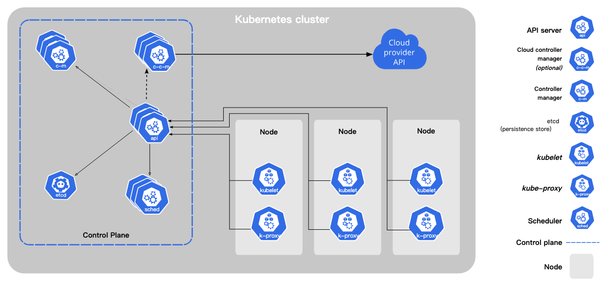

why k8s?
It allows for easy scalability, high resilience, application portability, automation of many tasks, and standardization of the container platform

先看到以下這張圖,這是官方提供的k8s組成,你會注意到幾個關鍵元件:Kubernetes cluster,Control plan, Node.簡言之,kubernetes cluster由多個worker node(硬體資源)及control plane組成.

 Kubernetes基本運作: worker node會託管pod(以容器化建立的應用程式),而control plane會管理cluster內的worker node跟pod.

細部看,這幾個關鍵元件底下也是由多個元件組成.以下簡單介紹control plane,pod,woker node的組成.

## control plane

控制平面對集群做出全局決策,並檢測及回應集群事件,例如:檢測到部署的pod不滿足deployment應部署的pod數量時,會起新pod.由kube-apiserver,etcd,kube-scheduler ,kube-controller-manager,cloud-controller-manager組成！

### kube-apiserver

kube-apiserver是API伺服器,為 Kubernetes 控制平面的前端,主要負責公開k8s的api.從 Command Line 下 kubectl 指令就會把指令送到這裏,同時也是不同node之間溝通的轉介點.

### etcd

etcd是key value存儲庫,用來放k8s的集群數據,這邊資料建議要有備份計畫

### kube-scheduler

kube-scheduler它監視新創建的未分配節點的 Pod，並為它們選擇一個節點來運行,這個選擇過程可以與資源需求、硬件/軟件/策略約束、親和性和反親和性規範、數據本地性、工作負載之間的干擾以及截止期限等有關！

### kube-controller-manager

kube-controller-manager運行控制器進程,每個控制器是獨立process,這些 Process 會在 Cluster 與預期狀態（desire state）不符時嘗試更新現有狀態（current state）.控制器有許多不同類型:

1. Node 控制器：負責在節點關閉時通知並響應。
2. Job 控制器：監視代表一次性任務的 Job 對象，然後創建 Pods 來執行這些任務直到完成。
3. EndpointSlice 控制器：填充 EndpointSlice 對象（用於提供服務和 Pods 之間的鏈接）。
4. ServiceAccount 控制器：為新的命名空間創建默認的 ServiceAccount。
除以上還有很多其他類型的控制器！

### cloud-controller-manager

cloud-controller-manager內置了特定於雲端的控制邏,如果有用到雲端服務才會用到它,cloud-controller-manager 允許將集群與雲提供商的 API 連接起來，並將與該雲平台交互的組件從僅與您的集群交互的組件中分離出來。

## pod

一個 Pod 對應到一個應用服務,一班情況最好一個pod一個container,而每個 Pod 都有一個身分證，也就是屬於這個 Pod 的 yaml 檔.同pod的container彼此可以透過port溝通.

## worker node

每個 Node 中有這幾個組件kubelet、kube-proxy、Container runtime

### kubelet

每個工作節點上運行的 kubelet 首先會註冊到control plane,接著它負責與control plane溝通,管理pod狀態並確保容器在 Pod 內運行.主要透過各種機制提供一組PodSpecs並確保PodSpecs 中描述的容器運行並保持健康。

### kube-proxy

kube-proxy 在 Kubernetes 集群中做網路管理，負責維護節點間的通訊和更新 iptables 規則，以確保服務和 Pod 的正確運行和通信。同時，它也促使節點間的資訊同步，使得 Kubernetes 中的各個組件可以準確地獲取節點上所有 Pods 的狀態。

### Container Runtime

容器運行時是負責運行容器的軟體。

## 部署服務過程

k8s如何部署服務？

簡單過程: 透過指令建立deployment,control plane會依據deployment設定出需求的pod.

較詳細過程於以下:

1. 使用 kubectl 命令建立deployment資源,過程會將 YAML 資源文件轉換為 JSON 格式，然後將其發送到位於控制平面內的 API Server。

2. API Server 收到請求後，將部署的詳細信息或對象定義持久化到etcd數據庫中。

3. 當 etcd 存儲中添加了新的 Deployment 資源後，API Server 會將相關的事件通知controller manager，controller manager創建足夠的 Pod 資源以匹配 Deployment 中的副本數量。此時，在 etcd 中的部署狀態為「Pending」。

4. Scheduler檢測到「Pending」狀態後，會檢查基礎設施的狀態，對節點進行篩選和排序，以決定在哪個節點上建立 Pod。然後，Scheduler根據其業務邏輯填充 Pod 的 Spec 中的「nodeName」字段，並將已調度的 Pod 對象以「Scheduled」狀態持久化到 etcd 中.

5. 一旦Pod被調度到Wokernode上,kubelet 會負責創建Pod中定義的容器。

6. Pod 調度： 當 kubelet 從 API Server 獲取到新 Pod 的規範後，它會檢查該規範，然後使用container runtime（如 Docker）創建相應的container。kubelet 會監控容器的運行狀態，並在需要時重新啟動容器。

7. 健康檢查： kubelet 會執行就緒探針（readiness probe）和存活探針（liveness probe），以確定容器是否就緒並保持運行狀態。如果探針指示容器不健康，kubelet 可能會重新啟動該容器。

8. 報告狀態： kubelet 會定期向 API Server 報告它所管理的 Pod 的狀態。這包括該 Pod 是否正常運行、就緒狀態等信息。API Server 使用這些狀態信息來更新control plane的資源狀態,無問題Pod 的狀態變為「Running」,Deployment 的狀態變為「Ready」.

## pod間的溝通

比較大型的程式會有很多個pod,他們之間要如何傳遞資訊？ 在VＭ用的是固定的ip跟port,而在k8s因為會牽涉到自動擴展,用ip跟port去溝通顯然會遇到找不到ip跟port的問題. 所以k8s發展了抽象層service來抽象化這個過程,並透過kube-proxy做實際的流量轉發.

### service類型

服務可以使用不同的類型，如 ClusterIP、NodePort、LoadBalancer 和 ExternalName。這些服務類型提供了不同的方式來實現 Pod 間和集群內外的通訊。

- ClusterIP： 默認的服務類型，將 Pod 部署到集群內部，並使用集群內部的 IP 地址進行通訊。這對於集群內部的 Pod 之間的通訊非常有用。

- NodePort： 將一個服務公開到集群節點的某個端口上，並使用該節點的 IP 和該端口進行訪問。Kubernetes 會在每個節點上打開一個高隨機端口（通常在範圍 30000-32767）,並將這個端口映射到你指定的服務的目標端口,
當有多個服務使用 NodePort 且指定相同的高隨機端口時。這可能會導致一些服務衝突，或者不正確地路由到其他服務上。
- LoadBalancer： 在支援的雲提供商上，可以創建外部負載均衡器，並將其配置到服務上。這使得外部流量可以通過負載均衡器轉發到服務內的 Pod。

- Ingress： Ingress 是一個控制器，用於管理外部對集群中服務的訪問。通過 Ingress，你可以設定不同的路由和規則，並將流量導向到不同的 Service 或 Pod。Ingress 支援 SSL/TLS 加密、主機名和路徑的路由，是一個更高級的方式來管理外部訪問。

- ExternalName： 通過 CNAME 記錄將服務名稱映射到外部的 DNS 名稱。這對於需要將內部服務與外部服務關聯起來的場景很有用。

## 小結

Kubernetes 部署程式需要透過 Deployment 創建 Pod 並管理與更新，而各個 Pod 之間的溝通通常透過 Service 提供穩定的 DNS 名稱和 IP 地址，讓 Pod 間可以使用標籤進行通訊，從而實現彈性、可靠的通訊機制。

:::info
參考資料

1. [Kubernetes Cluster & Process Flow of a POD creation](https://belowthemalt.com/2022/04/08/kubernetes-cluster-process-flow-of-a-pod-creation/)
2. [Kubernetes Components](https://kubernetes.io/docs/concepts/overview/components/)
3. [Kubernetes 基礎教學（一）原理介紹](https://cwhu.medium.com/kubernetes-basic-concept-tutorial-e033e3504ec0)

:::
