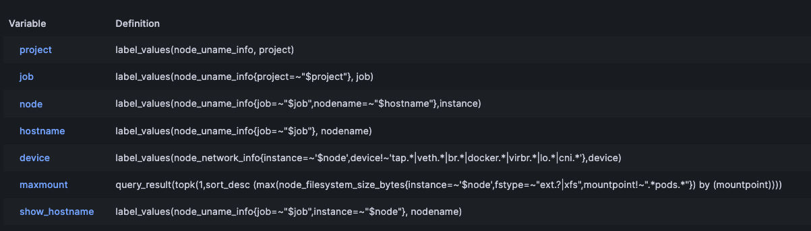

## kibana

這邊用docker-compose起服務,不過會有conatiner一個使用者,而非預設的root

```bash
mkdir -p ./data
chown -R 472:472 ./data
```

```yaml
version: "3.3"
services:
  grafana:
    image: grafana/grafana-enterprise:9.5.6
    user: "472"
    container_name: grafana
    restart: unless-stopped
    environment:
     - GF_SERVER_ROOT_URL=http://*.948787.store/
     - GF_INSTALL_PLUGINS=grafana-clock-panel
    ports:
     - '3000:3000'
    volumes:
     - '$PWD/data:/var/lib/grafana'
```

基本上,grafana只要設定資料源去拉prometheues,然後知道怎麼找適合的dashboard,以及變數如何設定就差不多！


```bash
| Variable       | Definition |
| -------------- | ---------- |
| project        | `label_values(node_uname_info, project)` |
| job            | `label_values(node_uname_info{project=~"$project"}, job)` |
| node           | `label_values(node_uname_info{job=~"$job",nodename=~"$hostname"},instance)` |
| hostname       | `label_values(node_uname_info{job=~"$job"}, nodename)` |
| device         | `label_values(node_network_info{instance=~'$node',device!~'tap.*|veth.*|br.*|docker.*|virbr.*|lo.*|cni.*'},device)` |
| maxmount       | `query_result(topk(1,sort_desc (max(node_filesystem_size_bytes{instance=~'$node',fstype=~"ext.?|xfs",mountpoint!~".*pods.*"}) by (mountpoint)))` |
| show_hostname  | `label_values(node_uname_info{job=~"$job",instance=~"$node"}, nodename)` |

```
