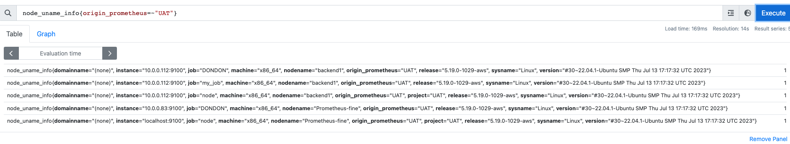

## kibana

這邊用docker-compose起服務,不過會有conatiner一個使用者,而非預設的root

```bash
mkdir -p ./data
chown -R 472:472 ./data
```

```yaml
version: "3.3"
services:
  grafana:
    image: grafana/grafana-enterprise:9.5.6
    user: "472"
    container_name: grafana
    restart: unless-stopped
    environment:
     - GF_SERVER_ROOT_URL=http://*.948787.store/
     - GF_INSTALL_PLUGINS=grafana-clock-panel
    ports:
     - '3000:3000'
    volumes:
     - '$PWD/data:/var/lib/grafana'
```

基本上,grafana只要設定資料源去拉prometheues,然後知道怎麼找適合的dashboard,以及變數如何設定就差不多！
<!--truncate-->
### 變數設定


| Variable      | Definition |
| ----------- | ----------- |
| origin_prometheus  | `label_values(origin_prometheus)`       |
| job   | `label_values(node_uname_info{origin_prometheus=~"$origin_prometheus"}, job)`        |
| hostname | `label_values(node_uname_info{origin_prometheus=~"$origin_prometheus",job=~"$job"}, nodename)` |
| node | `label_values(node_uname_info{origin_prometheus=~"$origin_prometheus",job=~"$job",nodename=~"$hostname"},instance)` |
....

這邊`label_values(origin_prometheus)`就是用`origin_prometheus`去配合service-level等級的label去找


第二行job則是 多了label`job`去分類目標主機,然後配合metric去分類主機,.

最後的效果就是在你的dashborad會可以看到各分類

### dashboard依據變數抓取主機

[這邊是以grafana模板11074為範例](https://grafana.com/grafana/dashboards/11074),最後的效果就會像

```
label_values(node_uname_info{job=~"$job"}, nodename)  
```
node_uname_info: 這是一個Prometheus監控系統中的metric指標名稱。它通常用來收集有關節點（主機）的系統資訊，例如操作系統的版本、主機名等。

{job=~"$job"}: 這是一個過濾條件，用於僅選擇特定的監控作業（job）。在這裡，您使用了正則表達式 $job 作為變數，該變數可能代表不同的作業名稱。

label_values(...): 這是一個PromQL函數，用於檢索指定metric的特定標籤（label）的所有可能值。在這個情境下，您想要獲取所有符合過濾條件的節點名稱。

nodename: 這是您想要獲取的標籤名稱，它可能代表每個節點的名稱。

簡言之,他會提取所有node_umane_info這個metric,過濾出含有job這個label的值,最後取得該metric剩下符合者的label是node_name這個的所有的值！