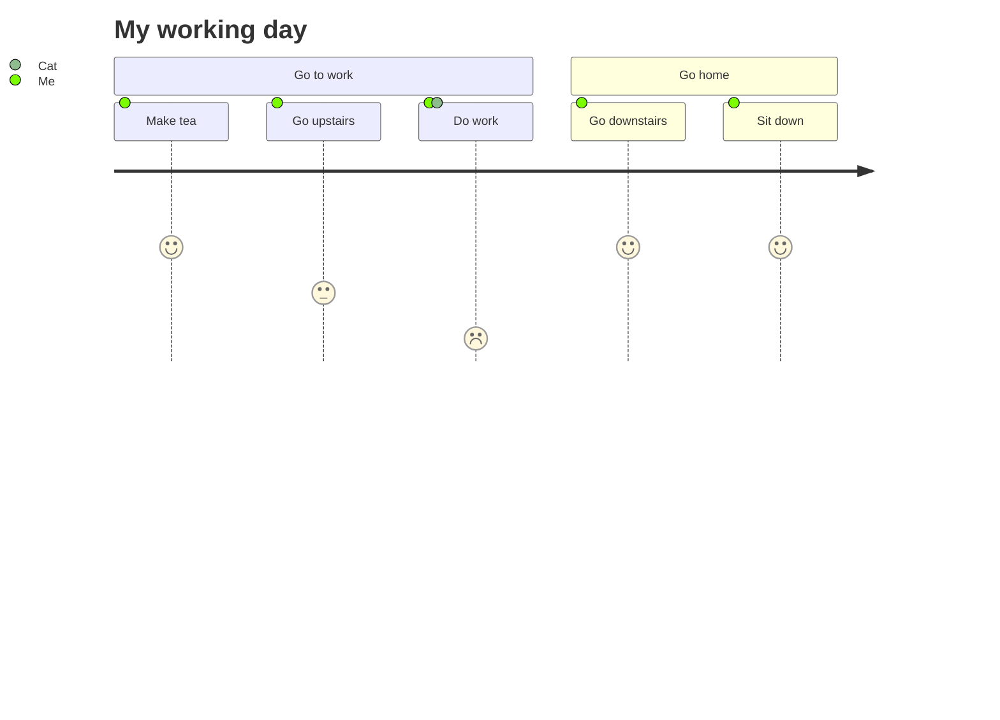

import Tabs from "@theme/Tabs";
import TabItem from "@theme/TabItem";
import Highlight from "@site/src/components/Highlight";

```
// how to import
import Tabs from "@theme/Tabs";
import TabItem from "@theme/TabItem";
import Highlight from "@site/src/components/Highlight";
```

<!--truncate-->

<Highlight color="#25c2a0">Docusaurus green</Highlight> and <Highlight color="#1877F2">
Facebook blue
</Highlight> are my favorite colors.

I can write **Markdown** alongside my _JSX_!

> Easy to maintain open source documentation websites.
>
> — Docusaurus

```
以下為上述用法的程式碼。
<Highlight color="#25c2a0">Docusaurus green</Highlight> and <Highlight color="#1877F2">
Facebook blue
</Highlight> are my favorite colors.

I can write **Markdown** alongside my _JSX_!

> Easy to maintain open source documentation websites.
>
> — Docusaurus
```

### Details element example

<details>
  <summary>Toggle me!</summary>
  <div>
    <div>This is the detailed content</div>
    <br />
    <details>
      <summary>Nested toggle! Some surprise inside...</summary>
      <div>😲😲😲😲😲</div>
    </details>
  </div>
</details>

```
<details>
  <summary>Toggle me!</summary>
  <div>
    <div>This is the detailed content</div>
    <br />
    <details>
      <summary>Nested toggle! Some surprise inside...</summary>
      <div>😲😲😲😲😲</div>
    </details>
  </div>
</details>
```

<>

  <div style={{ display: "flex", justifyContent: "center" }}>
    
  </div>
</>

```
how to import img
<>
  <div style={{ display: "flex", justifyContent: "center" }}>
    
  </div>
</>
```

### My Doc Section

Hello world message with some **bold** text, some _italic_ text, and a [link](https://www.yahoo.com)

```
//demo bold text ,italic style and superlink
Hello world message with some **bold** text, some _italic_ text, and a [link](https://www.yahoo.com)
```

<Tabs>
  <TabItem value="apple" label="Apple" default>
    This is an apple 🍎
  </TabItem>
  <TabItem value="orange" label="Orange">
    This is an orange 🍊
  </TabItem>
  <TabItem value="banana" label="Banana">
    This is a banana 🍌
  </TabItem>
</Tabs>

<!-- 保存資料到query string -->

<Tabs groupId="current-os" queryString>
  <TabItem value="android" label="Android">
    Android
  </TabItem>
  <TabItem value="ios" label="iOS">
    iOS
  </TabItem>
</Tabs>

```
demo tabs and tabs bring query string
// here are just tabs
<Tabs>
  <TabItem value="apple" label="Apple" default>
    This is an apple 🍎
  </TabItem>
  <TabItem value="orange" label="Orange">
    This is an orange 🍊
  </TabItem>
  <TabItem value="banana" label="Banana">
    This is a banana 🍌
  </TabItem>
</Tabs>

//here bring query string
<Tabs groupId="current-os" queryString>
  <TabItem value="android" label="Android">
    Android
  </TabItem>
  <TabItem value="ios" label="iOS">
    iOS
  </TabItem>
</Tabs>
```

```jsx title="/src/components/HelloCodeTitle.js"
function HelloCodeTitle(props) {
  return <h1>Hello, {props.name}</h1>;
}
```

````
```jsx title="/src/components/HelloCodeTitle.js"
function HelloCodeTitle(props) {
  return <h1>Hello, {props.name}</h1>;
}
```
````

```jsx {1,4-6,11}
import React from "react";

const MyComponent = (props) => {
  if (props.isBar) {
    return <div>Bar</div>;
  }

  return <div>Foo</div>;
};

export default MyComponent;
```

````
```jsx {1,4-6,11}
import React from "react";

const MyComponent = (props) => {
  if (props.isBar) {
    return <div>Bar</div>;
  }

  return <div>Foo</div>;
};

export default MyComponent;
```
````

```jsx live
// need install jsx live
function Clock(props) {
  const [date, setDate] = useState(new Date());
  useEffect(() => {
    const timerID = setInterval(() => tick(), 1000);

    return function cleanup() {
      clearInterval(timerID);
    };
  });

  function tick() {
    setDate(new Date());
  }

  return (
    <div>
      <h2>It is {date.toLocaleTimeString()}.</h2>
    </div>
  );
}
```

````
```jsx live
// need install jsx live
function Clock(props) {
  const [date, setDate] = useState(new Date());
  useEffect(() => {
    const timerID = setInterval(() => tick(), 1000);

    return function cleanup() {
      clearInterval(timerID);
    };
  });

  function tick() {
    setDate(new Date());
  }

  return (
    <div>
      <h2>It is {date.toLocaleTimeString()}.</h2>
    </div>
  );
}
```
````

<!-- Prettier changes this -->

:::note

Some **content** with _Markdown_ `syntax`. Check [this `api`](#).

:::

:::tip

Some **content** with _Markdown_ `syntax`. Check [this `api`](#).

:::

:::info

Some **content** with _Markdown_ `syntax`. Check [this `api`](#).

:::

:::caution

Some **content** with _Markdown_ `syntax`. Check [this `api`](#).

:::

:::danger

Some **content** with _Markdown_ `syntax`. Check [this `api`](#).

:::

```

:::note

Some **content** with _Markdown_ `syntax`. Check [this `api`](#).

:::

:::tip

Some **content** with _Markdown_ `syntax`. Check [this `api`](#).

:::

:::info

Some **content** with _Markdown_ `syntax`. Check [this `api`](#).

:::

:::caution

Some **content** with _Markdown_ `syntax`. Check [this `api`](#).

:::

:::danger

Some **content** with _Markdown_ `syntax`. Check [this `api`](#).

:::
```

[Download this docx using Markdown](./DONe.json)

```
[Download this docx using Markdown](./DONe.json)
```

<ul>
  {Object.entries(frontMatter).map(([key, value]) => (
    <li key={key}>
      <b>{key}</b>: {value}
    </li>
  ))}
</ul>

```
// how to get build in object attributes
<ul>
  {Object.entries(frontMatter).map(([key, value]) => (
    <li key={key}>
      <b>{key}</b>: {value}
    </li>
  ))}
</ul>
```

<>

<ol>
  <li class="text-body-color mb-4 flex text-base">
    <span
      class="bg-primary mr-2 flex max-h-[24px]  w-full max-w-[24px]  items-center justify-center rounded-full text-base  text-white"
    >
      1
    </span>
    Lorem ipsum dolor sit amet
  </li>
  <li class="text-body-color mb-4 flex text-base">
    <span
      class="bg-primary mr-2 flex h-6 w-full max-w-[24px] items-center justify-center rounded-full text-base text-white"
    >
      2
    </span>
    It is a long established fact reader
  </li>
  <li class="text-body-color mb-4 flex text-base">
    <span
      class="bg-primary mr-2 flex h-6 w-full max-w-[24px] items-center justify-center rounded-full text-base text-white"
    >
      3
    </span>
    The point of using Lorem Ipsum
  </li>
  <li class="text-body-color mb-4 flex text-base">
    <span
      class="bg-primary mr-2 flex h-6 w-full max-w-[24px] items-center justify-center rounded-full text-base text-white"
    >
      4
    </span>
    There are many variations of passages
  </li>
  <li class="text-body-color mb-4 flex text-base">
    <span
      class="bg-primary mr-2 flex h-6 w-full max-w-[24px] items-center justify-center rounded-full text-base text-white"
    >
      5
    </span>
    If you are going to use a of Lorem
  </li>
</ol>
</>

```
<>

<ol>
  <li class="text-body-color mb-4 flex text-base">
    <span
      class="bg-primary mr-2 flex max-h-[24px]  w-full max-w-[24px]  items-center justify-center rounded-full text-base  text-white"
    >
      1
    </span>
    Lorem ipsum dolor sit amet
  </li>
  <li class="text-body-color mb-4 flex text-base">
    <span
      class="bg-primary mr-2 flex h-6 w-full max-w-[24px] items-center justify-center rounded-full text-base text-white"
    >
      2
    </span>
    It is a long established fact reader
  </li>
  <li class="text-body-color mb-4 flex text-base">
    <span
      class="bg-primary mr-2 flex h-6 w-full max-w-[24px] items-center justify-center rounded-full text-base text-white"
    >
      3
    </span>
    The point of using Lorem Ipsum
  </li>
  <li class="text-body-color mb-4 flex text-base">
    <span
      class="bg-primary mr-2 flex h-6 w-full max-w-[24px] items-center justify-center rounded-full text-base text-white"
    >
      4
    </span>
    There are many variations of passages
  </li>
  <li class="text-body-color mb-4 flex text-base">
    <span
      class="bg-primary mr-2 flex h-6 w-full max-w-[24px] items-center justify-center rounded-full text-base text-white"
    >
      5
    </span>
    If you are going to use a of Lorem
  </li>
</ol>
</>
```

actions/checkout@v3 參數篇

- `ref`：要檢出的分支、標籤或提交 ID。
- `repository`：要檢出的儲存庫名稱。
- `submodules`：是否檢出子模組。
- `ssh-key`：用於從儲存庫獲取程式碼的 SSH 金鑰。
- `persist-credentials`：是否在持久化工作區時保存 GITHUB_TOKEN 和 SSH_AUTH_SOCK 環境變數。
- `fetch-depth`：要檢出的提交數量。
- `lfs`：是否下載 Git LFS 文件。
- `clean`：是否在檢出前運行 `git clean`。
- `workspace`：檢出的儲存庫的目錄。

<kbd>F1</kbd> <kbd>F2</kbd> <kbd>F3</kbd> <kbd>F4</kbd>

<kbd>Ctrl</kbd> + <kbd>C</kbd>

<kbd>🡄</kbd> <kbd>🡆</kbd> <kbd>🡅</kbd> <kbd>🡇</kbd>

<kbd>PrtScn</kbd> <kbd>Tab ↹</kbd>

<kbd>Enter</kbd>

<kbd>⊞ Win</kbd>

<kbd>😆</kbd>

```
<kbd>F1</kbd> <kbd>F2</kbd> <kbd>F3</kbd> <kbd>F4</kbd>

<kbd>Ctrl</kbd> + <kbd>C</kbd>

<kbd>🡄</kbd> <kbd>🡆</kbd> <kbd>🡅</kbd> <kbd>🡇</kbd>

<kbd>PrtScn</kbd> <kbd>Tab ↹</kbd>

<kbd>Enter</kbd>

<kbd>⊞ Win</kbd>

<kbd>😆</kbd>
```

並設定

```jsx title="src/css/custom.css"
kbd {
  margin: 0px 0.2em;
  padding: 0.1em 0.6em;
  border-radius: 3px;
  border: 1px solid #ccc;
  color: rgb(51, 51, 51);
  font-family: "Arial Black", Impact;
  display: inline-block;
  box-shadow: 0 1px 0px rgba(0, 0, 0, 0.2), 0 0 0 2px #fff inset;
  background-color: rgb(247, 247, 247);
  -moz-box-shadow: 0 1px 0px rgba(0, 0, 0, 0.2), 0 0 0 2px #fff inset;
  -webkit-box-shadow: 0 1px 0px rgba(0, 0, 0, 0.2), 0 0 0 2px #fff inset;
  -moz-border-radius: 3px;
  -webkit-border-radius: 3px;
}
```

圖表要先執行
`yarn add @docusaurus/theme-mermaid`,並添加 config 到`docusaurus.config.js`,不知道要怎麼填可以看我的 github 的 repo 的`docusaurus.config.js`

[mermaid 官網](https://mermaid.js.org/syntax/flowchart.html)

```
module.exports = {
  markdown: {
    mermaid: true,
  },
  themes: ['@docusaurus/theme-mermaid'],
};
```


語法

````

````



語法

````

````
