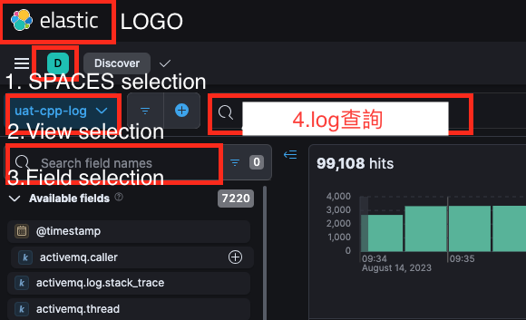

## 查詢介紹



- SPACES selection: 通常會依據產品跟環境名稱命名,請依據你要查詢的產品做選擇,例如:A1-UAT,B2-PROD等,數字1方框在Elastic的術語是space.
- View selection: 這邊是依據模塊(應用程式)區分,透過往下拉開列表去選擇你可以選要看哪隻服務的log,也可以在展開列表中的查詢框直接search該服務名稱,ex.xxx-api,數字2方框在Elastic的術語是data view.
- Field selection: 如果這邊留空,查詢結果會給你所有的field資料(例如hostname,路徑位置等等),如果只是單純想看某欄位,這邊可以輸入該欄位名稱然後按加號,這樣就只會顯示出這個field的資料！
- Log查詢區域: 這邊是主要查詢log地方,透過K(kibana)QL語法去查詢,預設查詢沒有區分大小寫.


- Select time: 這邊是選擇時間,預設是用相對時間,也可以選擇時間段,ex.2023-8-8 09:00~2023-8-9 10:00.
- Query: 以上都選定後,透過這格做查詢


### KQL語法

Elastic查詢是透過某個data view去查底下的field,一個應用程式的日誌(data view)就像一張表,每個field就像是SQL的欄位,預設會看到很多field,例如:timestamp是標記時間,message標記訊息等.

### 查詢語法範例

查詢不分大小寫！

```text
2023/08/10 08:42:50 [error] 26457#0: *404504 "/data/info/index.html" is not found (2: No such file or directory), client: 192.168.0.11, server: h5.alloha.com, request: "GET /index/index/info/ HTTP/1.0", host: "www.alloha.com", referrer: "https://www.alloha.com:443/index/index/info/"
```

以查詢以上為例

- 查詢message field含有www關鍵字,注意KQL語法是用完全匹配,沒有完全匹配就不回,如果只記得關鍵字要加*

```kql
message:  *www*
```
如果你的關鍵字是中文,就不用加**,不然他會出不來
```kql
message:  路由
```

- 查詢message field含有這兩個字眼info以及not found的句子(精確匹配)

```kql
message:  info AND message: "not found"
```

- 查詢message field含有這兩個字眼info或not found的句子(精確匹配)

```kql
message:  info OR message: "not found"
```

- 查詢時間在2023-08-10九點到十點間的log

```kql
@timestamp >= "2023-08-10T09" AND @timestamp <= "2023-08-10T10"
```

:::info
參考資料

1. [Kibana Search Cheatsheet (KQL & Lucene)](https://www.timroes.de/kibana-search-cheatsheet)
2. [Kibana offical website](https://www.elastic.co/guide/en/kibana/current/kuery-query.html)

:::

## 驗證

要確認index是否建立,最直觀可以去看index有沒有跑出來！
比較次之的方法,去看es_log_dir指定的log位置裏面的`log-cluster.log`他預設每天會壓縮當日的log一次. 

如果沒發現有建立,那就要排查了,我一般都會做幾個方向排查

1. 檢查filebeat之類轉發日誌的服務,他對elastic的網路有沒有通
2. 檢查filebeat在/var/log/filebeat.log有沒有報錯,/var/lib/filebeat這邊的指針有沒有動(他原理是定時偵測檔案然後用指針方式標示他目前讀的位置,這樣才不會重複出去),如果發現指針根本沒動那一定是你日誌路徑錯了！
3. 把以上打通,還是掛的就要去確認是不是elastich問題

## ELK已知報錯

- shard爆量報錯如下,預設每個node上限是建立1000個shard,爆了要做調整(這邊先不討論超過1000是否合理)

```text 
[ERROR][o.e.x.i.IndexLifecycleRunner] [elastic-1] policy [filebeat] for index [.xxxxxx] failed on step [{"phase":"hot","action":"rollover","name":"attempt-rollover"}]. Moving to ERROR step
org.elasticsearch.common.ValidationException: Validation Failed: 1: this action would add [2] shards, but this cluster currently has [2999]/[3000] maximum normal shards open;
```
[解法就是去調整每個node上限shard](https://www.jianshu.com/p/8ea97bd0f037)

- 記憶體不足報錯,調整`jvm.options`中的記憶體量！一般建議是用二分之一記憶體！

