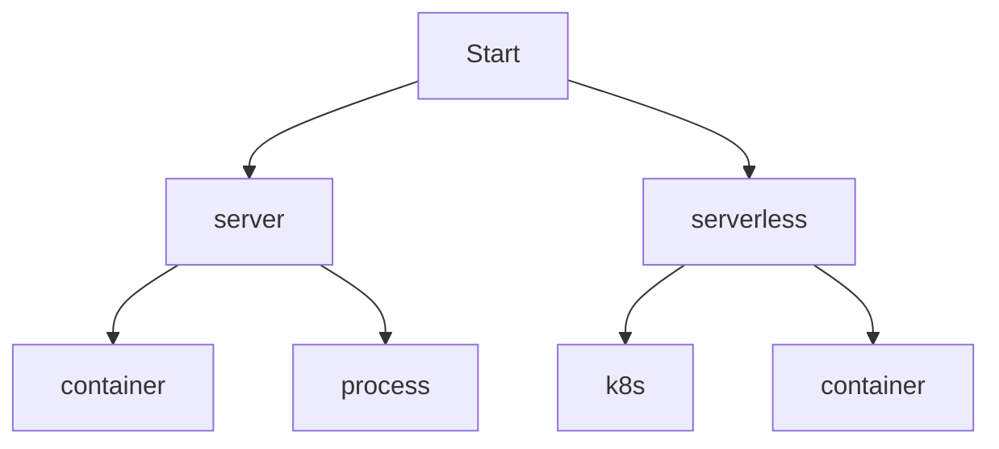

## IaC 常見管理項目

一個網路服務的提供,中間會經過許多關卡,這邊大致整理以下:

1. 軟體開發或者更新
2. 測試環境部署並測試
3. 正式環境上線
4. 監控

看幾來步驟很少,但實際上細相超多,而且隨著公司技術程度越高,這些過程會被切得越複雜.

軟體開發或者更新的過程,會被切割成,依據 github flow(每家邏輯不同)對各需求建立不同分支,RD 的 code 推上來之後,要確保品質會經過測試階段,最後合 code,接下來就是把 code 部署到測試環境部署並測試,測試沒問題就會部署到正式環境.

code 的穩定性那段由 CI 管理,部署過程是 CD,撇開合 code 那段每家公司不同,部署的 CD 有許多方法,但直接講 CD 就有點拉太遠,不如先從根本『環境』開使談.

要談環境之前,先來想一下一個封包怎麼由使用者端進到你的環境！這邊用一般 TLS 網路服務有使用憑證跟買網域的正常情況

使用者 request 域名->DNS 解析域名對應的 IP->防火牆允許封包通過-> Server 跟 client 做 TCP 三項交握 -> TLS 憑證驗證交握,驗證 TLS 憑證的有效性 -> web server 對封包用加解密 -> 應用程式處理封包中的請求 -> 將回應封包加密後再通過 TLS 協議傳送回 client -> 使用者

另外,環境的穩定性要透過監控軟體去監控！

而 IaC 精神就是把這整個過程的建置,用程式的方式建立,也就是發生了什麼事情,怎麼建立的,都是用程式去控制,如果某段掛掉或被看你不順眼的工程師砍掉,可以迅速地用程式執行備援方案把這段掛掉的補上. 所以以下的小節,會去討論每階段 IaC 有哪些工具可以使用.

### 域名管理

octopus:它是一個基於 Python 開發的工具，可以管理多種 DNS 服務商的 DNS 資源。

### 防火牆,路由表環境設定

### 憑證管理

### 應用程式部署方式

ansible:管理多個機器並進行軟件部署、配置和管理等操作

Terraform:跨雲端服務提供商（例如 AWS、GCP、Azure 等）進行基礎設施的管理,基本上你可以當作所有在雲端 UI 會操作的東西這邊都做得到,例外的東西不多,之後遇到補上.

### 監控程式

server 要決定的點有:要 serverless 還是要 server,server 部分是要容器化還是走 VM,容器話要用 k8s 還是一般 container 起服務

要走雲端還是地端還是混合

CD

域名管理工具

環境管理工具:

## 為什麼要學 IaC

現實問題是,不管是面試 DevOps 還是 SRE,每家公司去面試都會先問你用過的 IaC 工具,我自己的經驗是之前待過的公司不用這些複雜的東西就能發大財,用這些東西再導入時期還會有風險,不如乖乖的找工程師手動建立.

有些人的第一間公司就把這些工具用遍了,有些人則不是,所以出去面試被電也是正常的事情,回來還是要一步步去補足那些欠缺的東西.

如果自認 沒有比別人幸運,沒有比別人有天份,沒有比別人有背景,那能做的就是比別人有更多的耐心跟努力.

之後預計在每項工具會有該工具官網基本介紹, demo 基本功能,用自己的 code 的部署 demo,公司可能用得到的使用 demo.

4 大主流的組態管理工具 (Puppet, SaltStack, Chef, Ansible)
