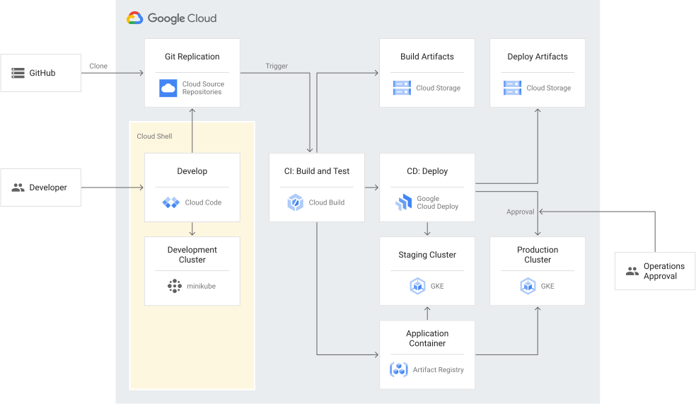

Cloud Build在這個lab會做到
- Use Build trigger to monitor changes to the source repo.
- When a change is committed into main branch, Cloud build trigger following:
  - Build artifacts in cloud storage bucket
  - Run test on the container
  - Place the app image in Artifact Registry
  - Call Cloud deploy to deploy the container to the staging environment.
- If all the build and tests are succesful, you can use Cloud Deploy to promote the container from staging to production.

Cloud deploy會註冊並管理pipline跟targets(指的是staging and production cluster).

這邊整理這個lab的建構過程,詳細步驟可以依照[官網資源](https://cloud.google.com/architecture/app-development-and-delivery-with-cloud-code-gcb-cd-and-gke/deployment)做學習.

官網大致流程:

1. 設定預設專案.會用到的指令`gcloud config set project PROJECT_ID`,可以用`gcloud config get-value project`檢查目前預設專案,查詢有哪些專案可以用`gcloud projects list`
2. 

後續的lab會拿我自己寫的程式,它原本是部署在docker上,會把它改成gke版本,config的放入會試試看config map跟
headless service等東西！

## 使用cloud deploy執行環境
1. cloud build worker pool 會讓deploy在該池中執行部署及驗證
2. cloud deploy需調用執行操作的帳號
3. cloud storage 的清單存放位置
4. 