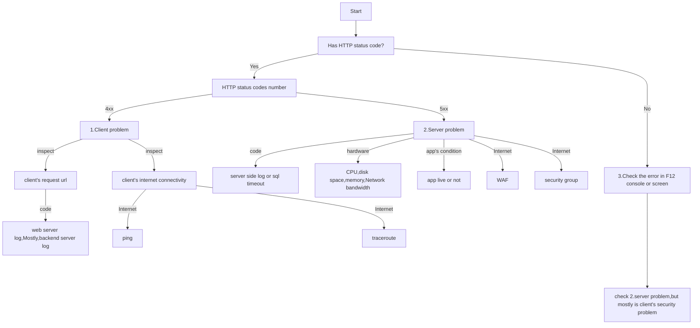

## 判斷邏輯

網路服務會發生問題狀況有很多,以下會用樹狀圖去做個判斷邏輯,當然這是建立在我目前遇到過的各種各樣情況上,同時也會加上判斷中會使用的方法！



### HTTP status 介紹

- 1xx - 資訊性狀態碼（Informational Status Codes）：表示請求已收到，並且伺服器仍在處理中.
- 2xx - 成功狀態碼（Success Status Codes）：表示請求成功被伺服器接受和處理.
- 3xx - 重新導向狀態碼（Redirection Status Codes）：表示需要進行進一步的操作以完成請求.
- 4xx - 用戶端錯誤 : 常見有 400 請求無效,server 無法理解,404 資源不存在
- 5xx（Server Error Status Codes）- 伺服器在處理請求時發生錯誤.

### 4xx 判斷過程及工具

出現 4xx 不一定全是 client 問題,因為這與你 server 端 code 可能有關係,可能今天問題是 RD 的靜態資源放錯路徑,前端拿不到,也有可能是客戶端編碼跟 API 串接方式錯誤等等.

在排查此類問題,客戶端提供的報錯節圖,url,跟網路速度都是重要判斷依據.如果明確知道問題原因,那可以直接跳階段測試,不知道原因的話建議可以以下判斷:

1. 靜態資源未拿到: 請客戶端檢查網路環境,提供網路速度,ping 跟 traceroute 結果,是否有清 cache,server 端確認是否有此資源,跟有無 purge.
2. 編碼問題: 這要看 server log,並請開發人員溝通.

順序問題,4xx 的問題可以從 client 端開始查到 server 端.

### 5xx 判斷過程跟工具

主要跟 code,hardware, app's condition,internet 都有關係,且可能彼此混雜,就 RD 覺得是 IT 設定 waf,IT 覺得是ＲＤ的程式問題. 也因此,建立判斷的過程很重要.

1. hardware 問題,基本上有裝監控項可以看到性能就沒問題
2. internet 問題,這邊就很複雜了,如果基本的 server 端互相 telnet 都有過,那接下來就要乖乖重投檢查了,這邊先不考慮 ICP 或雲服務商掛掉,這兩個掛掉應該很多網站都會掛,那剩下就是排查 waf.排查 waf 工具有以下

   - /etc/hosts: 綁定 DNS
   - web server 端的 curl.

#### 排查流程

網路發出的流程會是:`client`請求 -> CDN -> `web server`轉導-> `後端程式`處理

所以排查順序也可以是由外到內,client 端開始查,但通常都是並行的,就是 client 端那邊查網路連線品質,server 端也同時看服務情況跟 log.

- 情境一: 客戶反應說他的 request 被攔截了,原因是 xxx cors.

  檢查流程：

  1. 先去 CDN 看是否被 WAF 阻擋.
  2. web server 看是否有設定 WAF 或者有設定跨域設定,及其阻擋紀錄.
  3. 後端程式規範的跨域跟安全套件.

- 情境二: 客戶反應說他的 request 被攔截了,原因是 xxx header 的 sameorigin problem.

  檢查流程：

  1. 先去 CDN 看是否被 WAF 阻擋,如無,就綁定/etc/hosts 不走 CDN 直接到 web server ip 做測試
  2. web server 檢查是否有限定 header.
  3. 從 web server 那邊直接 curl 目標 server ip:port,ex.以下指令示範

```
curl -v http://10.0.0.1:92
```

去看請求後端時是否就有強迫帶該 header,如有就代表程式端有帶套件去加 header

4. code 端可能用的套件,例如 js 的`helmet`套件.

在測試流程中發現限制,也不代表你一定要開放,例如,iframe 的內嵌就會牽涉到點擊劫持,跨站腳本攻擊（Cross-Site Scripting, XSS),內容竊取,會限制就會有他的原因.

### 非 4xx 或 5xx

這個判斷基本上就是看 F12 報錯項目了,看完之後的判斷,也是依據 4xx 或 5xx 類別去判斷.

### 小結

基本上,排查流程一定要有個順序,由外到內或內到外(看習慣),客戶端到 server 中間的所有事情都要一個一個查,剛開始可能因為經驗不足,到一半就會放棄了,像我就是ＸＤ,但隨著時間增加,看得問題也變多了,就要去紀錄不足之處,以及中間固定要做的事情!

如果排查一遍還是找不到問題,就要去想你過程可能漏掉哪些細項,哪些測試是可以做但你還沒做或不知道怎麼做的！
