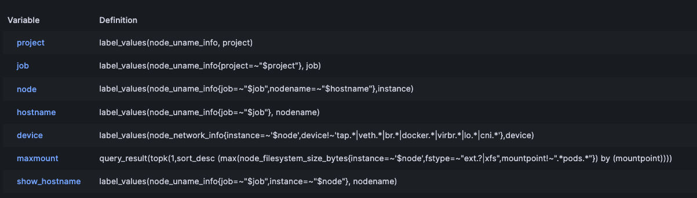

:::info

1. 跑版測試
2. ooooo

:::

## prometheus

相較於Zabbix系統使用mysql之類的關聯式資料庫,prometheus使用是的TSDB時序資料庫,因其主要功能聚焦在看log跟分析數據,並不需要對不同表格做關聯.

採用tsdb的prometheus最最直觀的差別就是

1. 使用 TSDB，它對系統資源的需求相對較低，這避免了 MySQL 等關聯式資料庫可能對系統資源的大量消耗
2. 由於 TSDB 專為時間序列數據設計，它可以更有效地索引和查詢此類數據，使 Prometheus 的查詢速度比使用傳統關聯式資料庫的系統更快
在我自己的測試環境,用一台free tier的機器運行prometheus,也可以跑很順！

### prometheus安裝

建立使用者

```bash
useradd --no-create-home --shell /bin/false prometheus
```

建立資料夾並授予使用者

```bash
mkdir -p /etc/prometheus /var/lib/prometheus
chown -R prometheus:prometheus /etc/prometheus /var/lib/prometheus
```

下載prometheus

```bash
wget https://github.com/prometheus/prometheus/releases/download/v2.44.0/prometheus-2.44.0.linux-amd64.tar.gz
tar xvfz prometheus-*.tar.gz

mv prometheus-2.44.0.linux-amd64 prometheuspackage
chown -R prometheus:prometheus prometheuspackage
```

搬移資料到目的

```bash
mv prometheuspackage/{console_libraries,consoles,prometheus.yml} /etc/prometheus/
mv prometheuspackage/{prometheus,promtool} /usr/local/bin
```

建立開機service

```bash
cat << EOF | sudo tee /usr/lib/systemd/system/prometheus.service
[Unit]
Description=Prometheus
Wants=network-online.target
After=network-online.target

[Service]
User=prometheus
Group=prometheus
Type=simple
ExecStart=/usr/local/bin/prometheus \
--config.file /etc/prometheus/prometheus.yml \
--storage.tsdb.path /var/lib/prometheus/ \
--web.console.templates=/etc/prometheus/consoles \
--web.console.libraries=/etc/prometheus/console_libraries \
--web.enable-admin-api \
--storage.tsdb.retention.time=30d \
--web.enable-lifecycle \

[Install]
WantedBy=multi-user.target
EOF

systemctl start prometheus
systemctl enable prometheus
```

完整版

```bash
#!/bin/bash
useradd --no-create-home --shell /bin/false prometheus
mkdir -p /etc/prometheus
mkdir -p /var/lib/prometheus
chown prometheus:prometheus /var/lib/prometheus
chown prometheus:prometheus /etc/prometheus
wget https://github.com/prometheus/prometheus/releases/download/v2.44.0/prometheus-2.44.0.linux-amd64.tar.gz
tar xvfz prometheus-*.tar.gz

mv prometheus-2.44.0.linux-amd64 prometheuspackage
chown -R prometheus:prometheus prometheuspackage/
cd prometheuspackage
mv console_libraries/ /etc/prometheus/
mv consoles/ /etc/prometheus/
mv prometheus.yml /etc/prometheus/
mv prometheus /usr/local/bin
mv promtool /usr/local/bin
cat << EOF | sudo tee /usr/lib/systemd/system/prometheus.service
[Unit]
Description=Prometheus
Wants=network-online.target
After=network-online.target

[Service]
User=prometheus
Group=prometheus
Type=simple
ExecStart=/usr/local/bin/prometheus \
--config.file /etc/prometheus/prometheus.yml \
--storage.tsdb.path /var/lib/prometheus/ \
--web.console.templates=/etc/prometheus/consoles \
--web.console.libraries=/etc/prometheus/console_libraries \
--web.enable-admin-api \
--storage.tsdb.retention.time=30d \
--web.enable-lifecycle \

[Install]
WantedBy=multi-user.target
EOF

systemctl start prometheus
systemctl enable prometheus
```

### 安裝node_exporter

相較於Zabbix有推拉模式,在Prometheus世界裡面基本上都是prometheus server主動去找prometheus target拉資料,也就是zabbix的主動模式！
那他到底怎麼拉資料？ prometheus target透過官方exporter,或者自建的exporter 安裝在自己身上,並開啟特定port讓prometheus server來撈資料.
其中最常用的是node_exporter! 就是收集ram,cpu,disk這些！

```bash
#!/bin/bash
# 安装Node Exporter
sudo useradd -rs /bin/false node_exporter
curl -LO https://github.com/prometheus/node_exporter/releases/download/v1.2.0/node_exporter-1.2.0.linux-amd64.tar.gz
tar xvf node_exporter-1.2.0.linux-amd64.tar.gz
sudo cp node_exporter-1.2.0.linux-amd64/node_exporter /usr/local/bin/
sudo chown node_exporter:node_exporter /usr/local/bin/node_exporter
rm -rf node_exporter-1.2.0.linux-amd64.tar.gz node_exporter-1.2.0.linux-amd64

# 创建Node Exporter服务文件
cat << EOF | sudo tee /etc/systemd/system/node_exporter.service
[Unit]
Description=Node Exporter
After=network.target

[Service]
User=node_exporter
ExecStart=/usr/local/bin/node_exporter

[Install]
WantedBy=default.target
EOF

# 启动Node Exporter服务
sudo systemctl daemon-reload
sudo systemctl start node_exporter
sudo systemctl enable node_exporter
```

ps.你也可以用docker起,他也可以透過主機接口去取到主機硬體數據

### prometheus設定

數據的組成是由Metric,跟Label組成.

直接查詢Metric你會拿到其底下的所有label的數據,使用label則會過濾掉一些不符合者！
相對於Zabbix把一些權限設定跟通知群組這些設定藏在UI藏得到處都是(ex.Zabbix那篇設定telegram),讓新手或者久沒操作的人很難找,如果之後有需要建一台新的zabbix,那也是很神奇的折磨,那用Prometheus的優點,就在於它所有東西都在設定檔內,無論設定使用者,設定告警轉發這些都是在設定檔內的,個人認為在管理上方便管理！

[config很多,可以看官網這](https://prometheus.io/docs/prometheus/latest/configuration/configuration/#scrape_config)

主要要知道

1. 怎麼scrape到你的主機,方法有很多
2. 觸發告警要怎麼寫

#### scrape設定

要到target抓metric資訊有很多方法,這邊列出我曾經用過的,基本上設定很多,官網也提供一個[設定檔範例](https://github.com/prometheus/prometheus/blob/main/config/testdata/conf.good.yml)給大家做格式參考.

1. `static config`-其實要是把ip跟port寫死,讓機器過去抓
2. `consul`-網路上查詢prometheus自動發現很常會出先現的方法,優點是
不限雲端或地端都可以做到自動發現,也有其他附加功能,但缺點是,單純用來做自動發現有點浪費且麻煩.
3. 雲端廠商提供的發現系統-如果使用雲端方案,在iam可以允許開放的情況下去,去做到自動發現,這個也是個快速的方案！ ex,azure,gcp,aws跟其他比較小家的在prometheus都有提供設定.
4. 文件自動發現: prometheus會定期來讀這隻檔案,去看有哪些新的主機要收資料.

`static config`設定範例如下:

```yaml
scrape_configs:
  - job_name: "node"
    scrape_interval: 5s
    static_configs:
      - targets:
        - 'localhost:9100'
        - '10.0.0.112:9100'
    #這邊以下為optional,但在實務上很重要,也相對難懂
        labels:
          project: UAT
          origin_prometheus: UAT
```

- 以上滿明顯就是到該ip and port那邊拿資料

:::info
在config中寫的lables是啥？
labels在prometheus有兩種,一種是掛在metric底下作為篩選資料的label,另一種是標示server-side的instance做的label,而server-side會在撈取target exporter的資料回來後做標示,這兩個的名稱可能會衝突,有`honor_lables`這個設定去做調整！有`__`開頭的是在過程中產生的label,它不會保留到最後,ex.`__address__`會在before label裡！

server-side label的使用,在之後於grafana製作dashboard時很重要,他可以透過server-side lable去做機器篩選跟分組等！

:::

#### 觸發告警

### 查詢語法

使用`PromQL`語法做查詢,並依據對應的`Metric`跟`Label`做查詢數據！
數據的組成是由Metric,跟Label組成,直接查詢Metric你會拿到其底下的所有label的數據,使用label則會過濾掉一些不符合者！
例如,你要查詢某台機器的ram使用率,你會先在上面安裝node_exporter,然後讓prometheus server去拉資料. 並使用以下語法做查詢

用`node_memory_MemAvailable_bytes`會看到

```bash
node_memory_MemAvailable_bytes{instance="10.0.0.112:9100", job="dummy", origin_prometheus="UAT", project="UAT"}
node_memory_MemAvailable_bytes{instance="10.0.0.112:9100", job="node", origin_prometheus="UAT", project="UAT"}....
```

那如果用`node_memory_MemAvailable_bytes{job="node"}`
就只會看到`job=node`的數據！

```bash
node_memory_MemAvailable_bytes{instance="10.0.0.112:9100", job="node", origin_prometheus="UAT", project="UAT"}....
```

`consul`網路上教學很多,可以自己找,他的優缺點寫在前面了.

`雲端廠商`這個很重要,主要還是有IAM設定,ex.gce最少要有對compute resoruces的read-only等,ec2要有ec2:DescribeInstances permission.以下為ec2範例：

```yaml
  - job_name: service-ec2
    ec2_sd_configs:
      - region: us-east-1
        access_key: access
        secret_key: mysecret
        profile: profile
        filters:
          - name: tag:environment
            values:
              - prod

          - name: tag:service
            values:
              - web
```

`file_sd_config`

```yaml
scrape_configs:
  - job_name: prometheus

    honor_labels: true
    # scrape_interval is defined by the configured global (15s).
    # scrape_timeout is defined by the global default (10s).

    # metrics_path defaults to '/metrics'
    # scheme defaults to 'http'.

    file_sd_configs:
      - files:
          - foo/*.slow.json
          - foo/*.slow.yml
          - single/file.yml
        refresh_interval: 10m
      - files:
          - bar/*.yaml
```

## kibana

這邊用docker-compose起服務,不過會有conatiner一個使用者,而非預設的root

```bash
mkdir -p ./data
chown -R 472:472 ./data
```

```yaml
version: "3.3"
services:
  grafana:
    image: grafana/grafana-enterprise:9.5.6
    user: "472"
    container_name: grafana
    restart: unless-stopped
    environment:
     - GF_SERVER_ROOT_URL=http://*.948787.store/
     - GF_INSTALL_PLUGINS=grafana-clock-panel
    ports:
     - '3000:3000'
    volumes:
     - '$PWD/data:/var/lib/grafana'
```

基本上,grafana只要設定資料源去拉prometheues,然後知道怎麼找適合的dashboard,以及變數如何設定就差不多！


```bash
| Variable       | Definition |
| -------------- | ---------- |
| project        | `label_values(node_uname_info, project)` |
| job            | `label_values(node_uname_info{project=~"$project"}, job)` |
| node           | `label_values(node_uname_info{job=~"$job",nodename=~"$hostname"},instance)` |
| hostname       | `label_values(node_uname_info{job=~"$job"}, nodename)` |
| device         | `label_values(node_network_info{instance=~'$node',device!~'tap.*|veth.*|br.*|docker.*|virbr.*|lo.*|cni.*'},device)` |
| maxmount       | `query_result(topk(1,sort_desc (max(node_filesystem_size_bytes{instance=~'$node',fstype=~"ext.?|xfs",mountpoint!~".*pods.*"}) by (mountpoint)))` |
| show_hostname  | `label_values(node_uname_info{job=~"$job",instance=~"$node"}, nodename)` |

```
